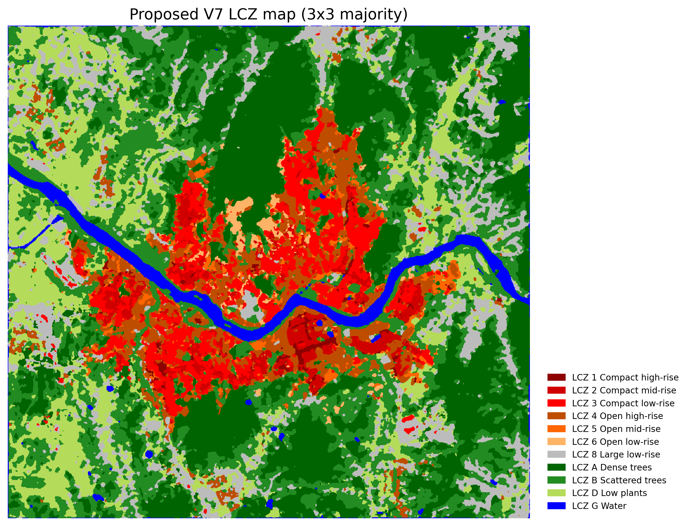
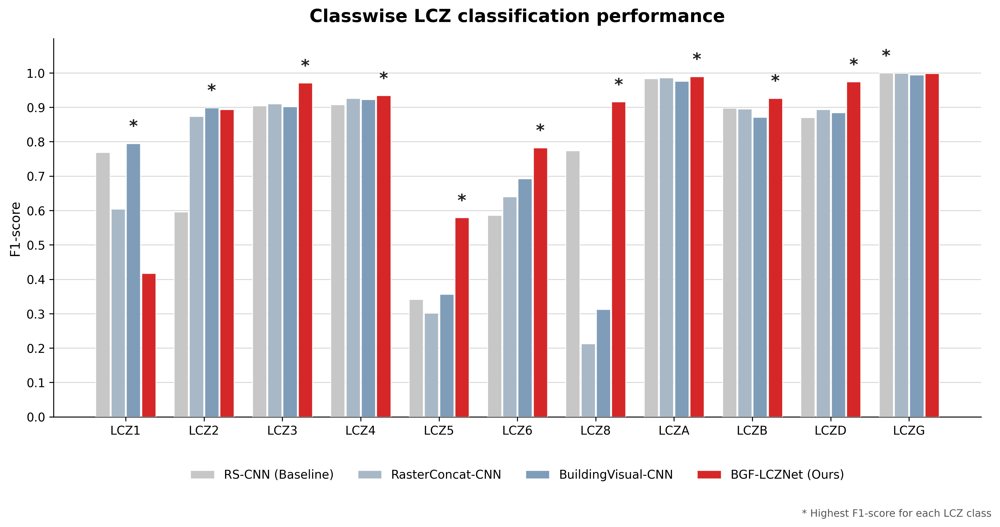

# 2026 Spring Remote Sensing AI — Seoul LCZ Classification

Deep-learning experiments for classifying **Local Climate Zones (LCZs) in Seoul** from Landsat remote-sensing imagery and building morphology. The repository compares an RS-only CNN with raster-based and graph-based building-data fusion models, and includes the complete V7 ablation study.



The figure above shows the final qualitative LCZ map for Seoul generated by the V7 graph-based model after majority-filter post-processing. Quantitative model comparisons are summarized below.

## What is included

- An RS-only CNN baseline.
- A dual visual encoder combining satellite and rasterized building features.
- Eleven iterations of a CNN + building-graph encoder.
- Controlled V7 ablations for salient-node selection, urban morphology parameters (UMP), global context, and edge types.
- Scripts for full-extent LCZ mapping, majority-filter post-processing, accuracy assessment, figure generation, and LCZ–LST zonal statistics.
- Compact experiment summaries, confusion matrices, training logs, and publication-ready figures.

## Main result

The strongest archived run is `CNN_RS_BuildingGraphEncoder_V7`, which improves test overall accuracy from **90.66%** (RS-only CNN) to **95.28%** and macro F1 from **78.43%** to **85.28%**.

| Model | Test OA | Macro F1 | Weighted F1 |
|---|---:|---:|---:|
| RS-only CNN baseline | 90.66% | 78.43% | 90.57% |
| Building Graph Encoder V7 | **95.28%** | **85.28%** | **95.03%** |

These values are read from the archived `summary.json` files in `results/experiments/`.



## Repository layout

```text
.
├── train/       # Model definitions and training entry points
├── code/        # Mapping, post-processing, evaluation, and plotting
├── notebooks/   # Input preparation and building-data processing
└── results/
    ├── experiments/ # Metrics and logs for baseline, V7, and ablations
    └── analysis/    # Tables and figures generated from the experiments
```

## Environment

Python 3.9 or newer is recommended. A CUDA-enabled PyTorch installation is required for GPU training.

```bash
python -m venv .venv
source .venv/bin/activate          # Windows: .venv\Scripts\activate
pip install -r requirements.txt
```

Install the PyTorch build appropriate for your CUDA version if the generic package does not match your system; see the official PyTorch installation selector.

## Data preparation

The original geospatial data are not committed because they total about 2.8 GB and may have separate redistribution terms. Place locally obtained inputs under `data/` using this layout:

```text
data/
├── GT/
│   ├── seoul_LCZ.tif
│   ├── lcz_polygonnumber_50m.tif
│   └── LCZ_class_from_components.csv
├── Satellite/
│   └── processed/
│       ├── norm/                 # b1_norm.mat ... b8_norm.mat
│       └── norm_rs_building/     # b1_norm.mat ... b10_norm.mat
├── Building/
│   └── AL_11_D010_20200502/      # Building shapefile and sidecar files
├── class_excel/                  # Per-class train/test spreadsheets
└── mat_index/                    # Calibration, validation, and test indices
```

Use the notebooks in order to inspect and prepare these inputs:

1. `notebooks/01_prepare_model_inputs.ipynb`
2. `notebooks/02_process_building_data.ipynb`

Some notebook cells and script defaults retain the original Linux path (`/mnt/disk1/workspace_jym/LCZ`). Change those paths to your local project directory, or pass paths through the command-line options shown below.

## Reproduce the baseline and V7 model

From the repository root:

```bash
# RS-only baseline
python train/train_lcz_rs_cnn.py \
  --base_dir data \
  --work_dir work_dirs \
  --norm_dir data/Satellite/processed/norm \
  --exp_name cnn_rs_baseline \
  --patch_size 33 --batch_size 256 --epochs 150 --patience 25 \
  --class_weight

# Building Graph Encoder V7
python train/train_lcz_graph_encoder_v7.py \
  --base_dir data \
  --work_dir work_dirs \
  --rs_norm_dir data/Satellite/processed/norm \
  --building_shp data/Building/AL_11_D010_20200502/AL_11_D010_20200502.shp \
  --story_col A10 \
  --split_dir work_dirs/cnn_rs_baseline/splits \
  --exp_name graph_v7_node_edge_scale_interaction_oa \
  --patch_size 33 --graph_context_m 500 \
  --global_scales_m 330 500 700 \
  --edge_mode hybrid --knn 8 --radius_m 120 \
  --max_nodes 192 --graph_hidden 96 --graph_out 192 \
  --graph_layers 3 --graph_heads 4 \
  --batch_size 96 --epochs 180 --patience 35 \
  --lr 5e-4 --dropout 0.35 --class_weight --monitor oa \
  --rebuild_graph_cache
```

To run all controlled V7 ablations with the same split and training settings:

```bash
bash train/run_v7_ablation.sh
```

Every training script exposes additional options through `--help`.

## Analysis workflow

The numbered scripts in `code/` form the post-training workflow:

1. Generate full-extent LCZ predictions with one of the `1_map_*.py` scripts.
2. Visualize area statistics with `2_visualize_lcz_map_and_area.py`.
3. Calculate accuracy and class metrics with `3_accuracy_from_confusion_matrix.py`.
4. Compare class-wise metrics with the `4_plot_*.py` scripts.
5. Compare complete maps with `5_compare_full_lcz_maps.py`.
6. Apply a majority filter with `6_postprocess_lcz_majority_filter.py`.
7. Produce study-area subsets with the `7_crop_*.py` scripts.
8. Analyze LCZ–land-surface-temperature relationships with `8_lcz_lst_zonal_stats.py`.
9. Summarize the ablation study with scripts 9 and 10.

Run `python <script> --help` before each step; mapping and analysis scripts require the trained checkpoints and local raster inputs, which are intentionally excluded from Git.

## LCZ classes

Archived experiments use 11 classes: compact high-, mid-, and low-rise (LCZ 1–3), open high-, mid-, and low-rise (LCZ 4–6), large low-rise (LCZ 8), dense trees (LCZ A), scattered trees (LCZ B), low plants (LCZ D), and water (LCZ G).

